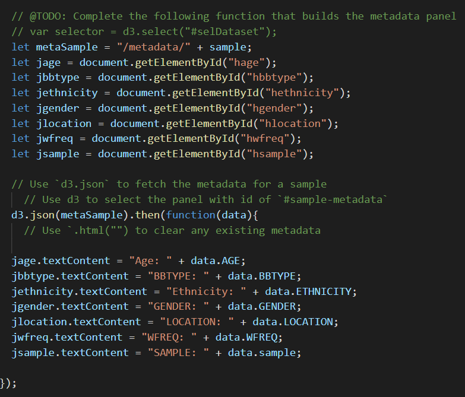

# Plot.ly Homework - Belly Button Biodiversity

## Step 1 - Plotly.js
The instructions weren't too clear.  But as it turns out, half of the work had been finished.  We just needed to create the code on javascript.  

First I created new lines in index.html.  These will be used for the metadata panel.  

I then selected the IDs and appended the json addresses to them. 

Next I built the charts.  This one took a bit longer. 

I first too the json data arrays and sliced them to just 10 values.  They were already sorted.  

Now I had my 3 arrays to use for the pie chart and the bubble plots. 

## Step 2 - Heroku
Heroku was tricky, I cam across the a problem with the Procfile. 

The Profile needs to say: 

web: gunicorn app:app

It wasn't written like this in the examples unfortunately. 

gunincorn must also be added to your requirements.txt. Otherwise the push to heroku will fail.  The error logs aren't very helpful unforntunately. 

## Findings

The requirements.txt file that came with the homework is out of date and has been throwning github security errors. I went ahead and updated them to the newer versions. 
